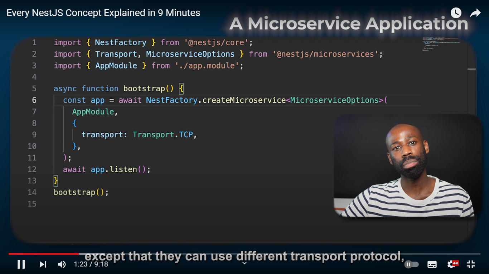

# 1. Application

# 2. Modules

# 3. Decorators

# 4. Controllers

# 5. Provider

# 6. Guards

If it is authenticated then it returns true.

If it returns False then the request is denied.

# 7.Middleware

# 8. Interceptor

# 9. Pipes

# 10. To catch an exception

